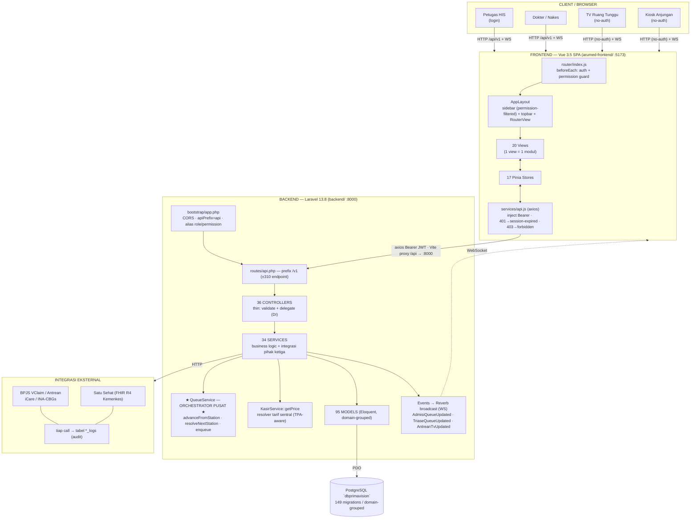
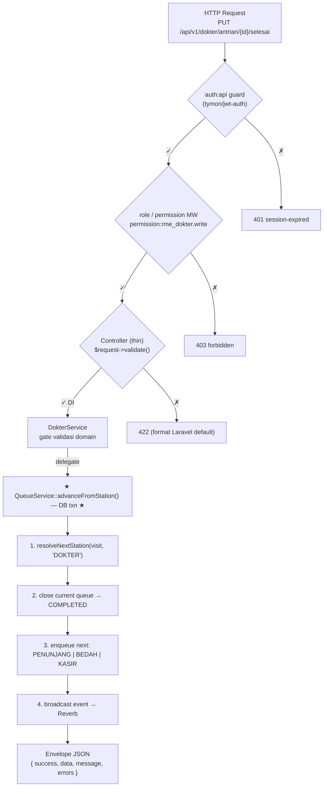
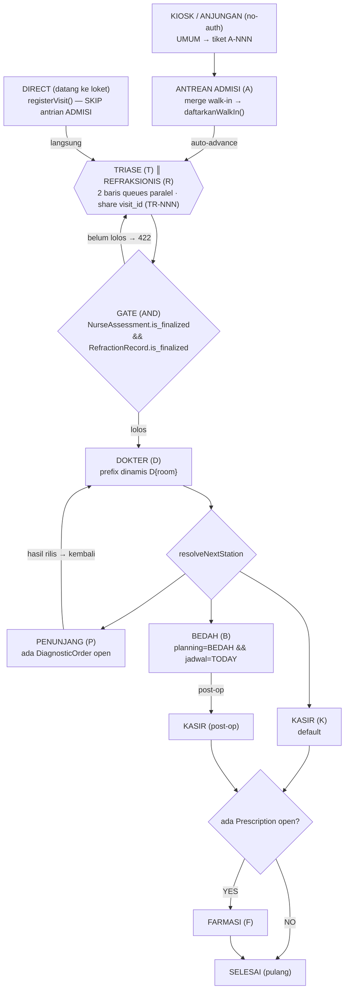

# Arumed Apps — Diagram Arsitektur

> Instance: **RS Mata Prima Vision (Medan)** — DB `dbprimavision`, tema biru.
> HIS oftalmologi paperless (PMK 24/2022), terintegrasi BPJS (VClaim/Antrean/iCare/INA-CBGs) + Satu Sehat.
>
> Render Mermaid: VSCode (extension *Markdown Preview Mermaid Support*) atau GitHub.
> Snapshot codebase: **36 controllers · 34 services · 95 models · 149 migrations · 20 views · 17 stores**.

---

## 1. Arsitektur Sistem (High-Level)

---

## 2. Layer Backend — Request Lifecycle

---

## 3. Alur Pasien — Patient Journey / Queue Stations

> **Catatan BEDAH jadwal hari lain:** kalau `surgery_schedules.scheduled_date > today`, Dokter selesai → **KASIR** (bukan BEDAH). Pasien pulang lewat Kasir & Farmasi, lalu daftar ulang dari ADMISI saat hari operasi tiba.

---

## 4. Stasiun Antrean (ringkasan)

| Kode | Station | Prefix | View | Catatan |
|------|---------|--------|------|---------|
| `A` | ADMISI | `A` | `AdmisiView` | hanya walk-in kiosk; direct daftar skip ADMISI |
| `T`+`R` | TRIASE + REFRAKSIONIS | `TR` | `PerawatView` + `RefraksionisView` | 2 baris paralel, gate-ke-D = AND |
| `D` | DOKTER | `D{room}` | `DokterView` | prefix dinamis per ruangan |
| `P` | PENUNJANG | `P` | `PenunjangView` | opsional (ada DiagnosticOrder) → balik ke D |
| `B` | BEDAH | `B` | `BedahView` | opsional (planning=BEDAH & jadwal TODAY) |
| `K` | KASIR | `K` | `KasirView` | billing + COB |
| `F` | FARMASI | `F` | `FarmasiView` | opsional (ada Prescription open) |

**Lifecycle status queue:** `WAITING → CALLED → IN_PROGRESS → COMPLETED` (atau `CANCELLED`). `lewati` = pindah ke akhir antrean station yang sama.

---

## 5. Prinsip Arsitektur (pola wajib)

- **Routes → Controller (thin) → Service (logic + integrasi) → Model.** Controller hanya `validate()` + delegate via DI.
- **`QueueService::advanceFromStation()` = satu-satunya** sumber routing antar-stasiun + broadcast TV. Semua station-service hanya thin wrapper + gate validasi domain.
- **`KasirService::getPrice`** = resolver tarif sentral per-insurer (procedure/medication/bhp/iol/equipment), TPA-aware.
- **RBAC:** 23 modul × R/W/D, middleware `role`/`permission`, Superadmin bypass via sentinel `["*"]`.
- **Frontend:** 1 view = 1 modul, 1 Pinia store per domain, tanpa UI lib eksternal (CSS scoped + design token). Sidebar di-filter `auth.can()`.
- **Integrasi eksternal** wajib lewat Service class + tulis ke tabel `*_logs` (audit dispute vendor).
- **Real-time** via Reverb (WS); fallback polling (8–30s) di store kalau WS tidak aktif.

---

_Dibuat untuk instance Prima Vision. Sinkronkan dengan `ARCHITECTURE.md` setiap ada perubahan endpoint / model / view._
